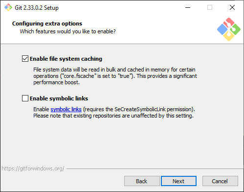

# [Jour 1/100] - Quels outils pour #100DaysOfDevOps ?

## INTRODUCTION

- Quels outils sont nécessaires pour apprendre les technos devops ?

## PRE-REQUIS

- Aucun pré-requis n'est nécessaire pour cela.

## CAS D'USAGE

- Pouvoir éditer du code pour de l'infrastructure as code => vscode
- Pouvoir versionner ce code => git
- Pouvoir monter des environnements de test sur mon poste de travail pour certaines technos (docker, kubernetes,... ) qui ne nécessite pas d'utiliser un fournisseur de Cloud => virtualbox

## Recherche

- ✍️ Document your trial and errors. Share what you tried to learn and understand about the cloud topic or while completing micro-project.
- 🖼️ Show as many screenshot as possible so others can experience in your cloud research.

## EN PRATIQUE

## VSCode

- Comment installer VSCode ? 

### Installation VSCode

- Se rendre sur https://code.visualstudio.com/
- Choisir le package relatif à son système d'exploitation *(pour ma part j'utilise Windows)*


- Suivre le processus d'installation


## Git

- Comment installer Git ?
- Comment configurer Git (les bases) ?

### Installation de Git

- Se rendre sur https://git-scm.com/downloads
- Choisir le package relatif à son système d'exploitation *(Pour ma part j'utilise Windows)*


 
- Suivre le processus d'installation spécifique à votre OS.





### Configuration git de base 
- Pour savoir qui commit 
```bash
git config --global user.name "Christophe @ctlabfr"
git config --global user.email "hello@ctlab.Fr"
```


### Initialiser un repository sur son poste
```bash
> cd 100daysofdevops
> git init
```


## Virtualbox

### Installation Virtualbox

- Se rendre sur 
- Choisir le package relatif à son système d'exploitation *(Pour ma part j'u>tilise Windows)*


 
- Suivre le processus d'installation spécifique à votre OS.


## Ce que je retiens de cette journée

- Premier jour de chauffe pour se lancer dans le défi #100DaysOfDevOps
- Rien de bien compliqué jusqu'ici
- Installation de quelques outils essentiels (à mon avis) pour pouvoir expérimenter et apprendre autour du devops.

## Prochaines étapes

- Définir un plan de route pour les 99 prochains jours

</br>
---
</br>


## Preuve Sociale

[@ctlabfr / 100daysofdevops - Jour 1]()
