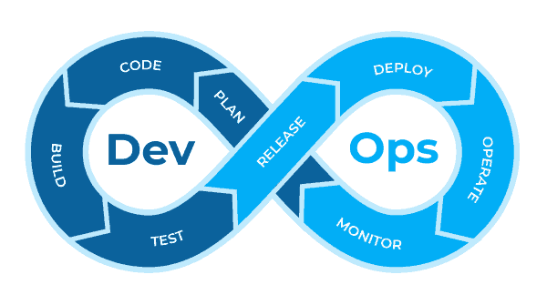
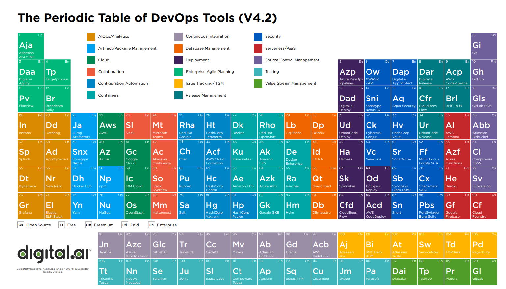

*Crédit: [Photo de Leah Kelley provenant de Pexels](https://www.pexels.com/fr-fr/photo/femme-regardant-la-carte-3935702)*

# [Jour 2 / #100DaysOfDevOps] Roadmap

## INTRODUCTION

- Par où commencer pour monter en compétence sur les technos DevOps ?
- Quelles compétences acquérir ?
- Quel est le chemin logique à suivre ?

## PRE-REQUIS

- Pas de pré-requis aujourd'hui

## CAS D'USAGE

- Identifier les compétences à acquérir
- Identifier les technologies associés à ces compétences
- Définir un plan d'action à suivre
- Essayer de planifier ce plan d'action sur les 98 jours restant

## RECHERCHE

### Ressources Youtube
- [Devops Engineer Roadmap | How to Become a DevOps Engineer?](https://www.youtube.com/watch?v=7wmEoY3hTms)
- [How to Learn DevOps Step by Step](https://www.youtube.com/watch?v=jI77-5MzBZU&t=1021s)
- [DevOps Roadmap 2021 - How to become a DevOps Engineer?](https://www.youtube.com/watch?v=9pZ2xmsSDdo)

### Articles
- [Wikipedia: Devops](https://fr.wikipedia.org/wiki/Devops)
- [Wikipedia: La chaîne d'outil devops](https://fr.wikipedia.org/wiki/Cha%C3%AEne_d%27outils_Devops)
- [AWS: What is devops ?](https://aws.amazon.com/fr/devops/what-is-devops/)
- [DevOps Roadmap](https://roadmap.sh/devops)

## EN PRATIQUE

### Qu'est ce que le devops ?

- DevOps = Dev (Developpement) + Ops (Opération)

- Association de compétences de développement et de compétences opérations afin de fluidifier le cycle de vie d'une application du développement à la mise en production

- La démarche devops est souvent associée à la boucle infinie 

- Chaque phase de cette boucle nécessite la maitrise de compétences particulières.

### Les compétences et les technos associées

1. Language de Programmation et de scripting
    - **Bash**, **python**, Go, node.js, Ruby, Rust, C, C++, Javascript, Java, Perl

2. Les sytèmes d'exploitation
    - OS: **Redhat / CentOS / Fedora, Debian / Ubuntu**, Suse, *BSD, Windows
    - OS Concept: **Gestion du Kernel**, **Gestion des processus**, Gestion du démarrage, **Threads & Concurrence**, Sockets, les bases de POSIX, **Gestion des I/O**, **Virtualisation/Conteneurisation**, **Gestion de la Mémoire**, Gestion du Stockage, **Architecture des systèmes de fichiers**, **Système de fichiers distribués**, Gestion des services, Concepts Réseaux

3. Sécurité, Réseaux et Protocoles
    - HTTP(S), FTP(S), SSL/TLS, SSH, Port Forwarding, IPSec & VPN, AT-TLS, OSPF Authentication, SNMP, Firewall, Proxy Services, Load Balancer

4. Configuration de serveur
    - Serveur Web: IIS, Nginx, Apache, Tomcat, Caddy
    - Serveur de cache: 
    - Prosy, Reverse Proxy: Istio, Envoy, Squid,  

5. Infrastructure as Code
    - Container: **Docker**, LXC, Podman
    - Container Orchestration: **Kubernetes**, Mesos, Docker Swarm, Nomad, Service Mesh, Istio, Linkerd, Consul Connet, Kuma, Maesh
    - Configuration Management: **Ansible**, Salt, Chef, Puppet
    - Infrastructure Provisioning: **Terraform, CloudFormation**, Pulumi

6. Outils CI/CD 
    - **Jenkins**, Gitlab CI, **Github, GitLab**, Bamboo, Travis CI, Azure DEvops, Circle CI, TeamCity

7. Supervision d'infrastructure
    - **Prometheus**, grafana, **nagios**, **zabbix**, monit, datadog, sensu

8. Supervision d'application
    - AppDynamics, Instana, OpenTracing, New Relic, Jaeger

9. Gestion des logs
    - Elastic Stack, Splunk, Papertail, **Graylog**

10. Fournisseur de Cloud
- **AWS**, Google Cloud, **Azure**, Heroku, Linode, Vultr, Digital Ocean, Alibaba Cloud,

## CE QUE JE RETIENS

- De nombreuses compétences et technologies à appréhender
- Il existe de nombreuses plateformes pour se former en ligne
    - [Udemy]()
    - [ACloudGuru]()
    - [PluralSight]()
- Et sinon les ressources gratuites 
    - [Youtube]()

## PROCHAINES ETPAES

- Démarrer la création d'un lab pour expérimenter ces technos: exploration de terraform avec le provider virtualbox pour provisionner des machines virtuelles sur mon poste dans Virtualbox.

## PREUVE SOCIALE

[@ctlabfr - Jour 2 / #100daysofdevops](link)

